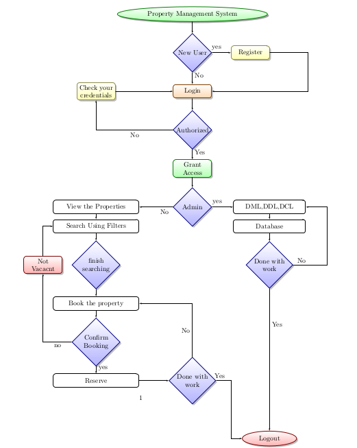

# Data Flow Diagram

<kbd></kbd>

The system starts operating from its
initial stage of authenticating the user from entering into the system whether it is an admin staff,
or the superuser, or the real world user. Each one of the participating members must login and
after successful completion of the work they should be to logout.
The system is so designed as to make it operable sequentially initiating from login mechanism to
fulfill the requirements For authentication. After successfully verifying the authorization the system
will open up a new window separately for both, the admin as well as the real world users. The admin
will look after DML,DDL,DCL while the users will engage with their own activities of searching
and booking. Having done with works, they can logout. the system is so designed such that all the
different layered members will perform their tasks and operations effectively and efficiently.
