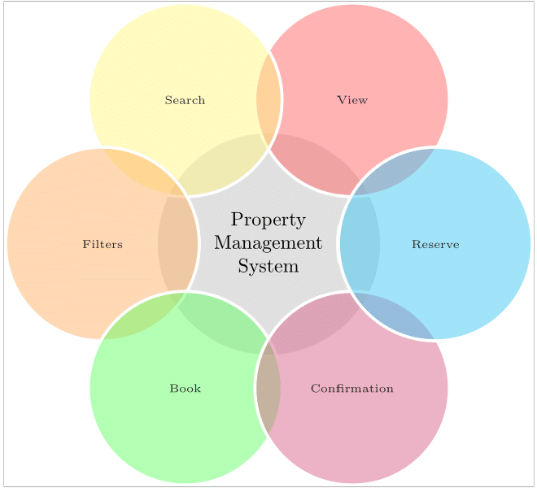

## Users Perspective: The Front View 
The various aspects an users expects from the system and which is my one of the main ideal outcomes of the project can be viewed from the following figure:

 

   Operations offered to the users

 

   The above figure portrays the exibilities and accessibilities provided to the users in order to perform various operations on the properties included in the databases. These are:  
  
 **1. _View:_**   The users can be able to properly view the property database along with its full description in order to perform the next task of searching of the desired assets.  
  
 **2. _Search:_**  This facility will enable the users to search the property from a huge list of properties as contained in the database.  
  
 **3. _Filter:_**  This exibility will help the user to filter the search by feeding up some necessary details such as location and name.  
  
 **4. _Book:_**  The accessibility to various assets and prperties can be done through the booking slots and the vacancy information.  
  
 **5. _Confirm:_**  Before taking the final step of reserving the property, it is mandatory to check any conicting reservation by other parties and hence to resolve it.  
  
 **6. _Reserve:_**  This the final step taken by the user to reserve the property according to their necessaties and requirements.
